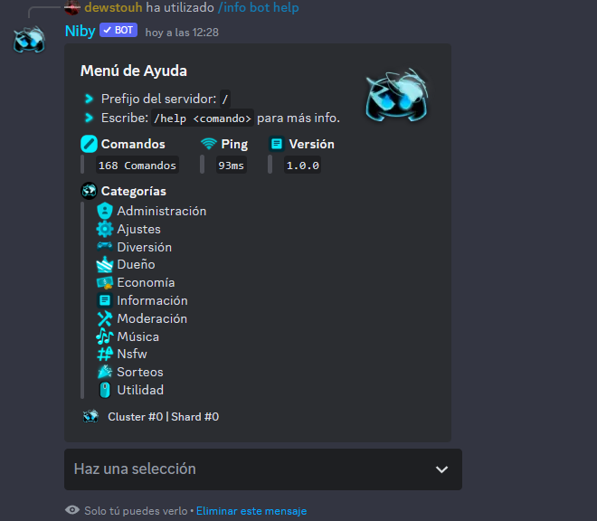
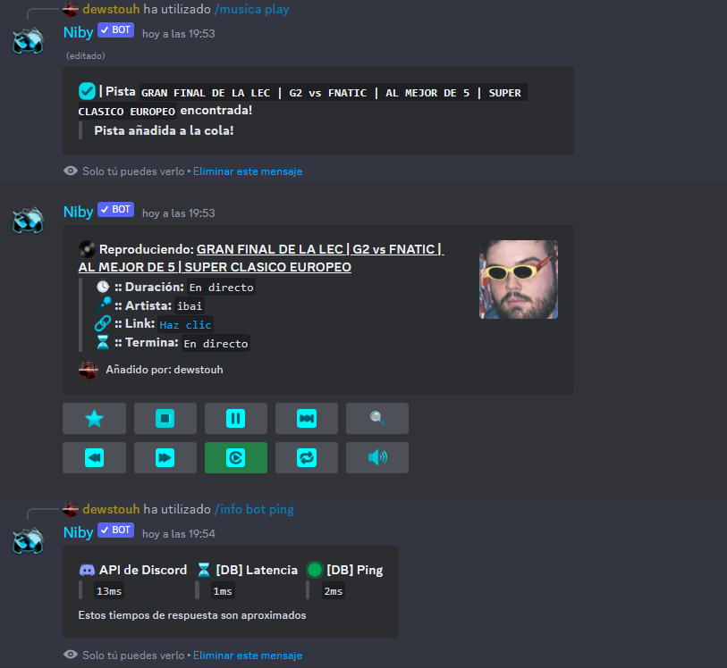

<div align="center">
 <a href="https://github.com/dewstouh/handler-v14/actions" target="_blank"></a>
 <a href="https://discord.gg/MBPsvcphGf" target="_blank"></a>
 <a href="https://discord.gg/MBPsvcphGf" target="_blank"></a>
 <a href="https://github.com/sponsors/dewstouh" target="_blank"></a>
 <a href="https://paypal.me/elmundodeniby" target="_blank"></a>
 <a href="https://www.typescriptlang.org/" target="_blank"></a>
 <a href="https://www.mongodb.com/" target="_blank"></a>
 <a href="https://redis.io/" target="_blank"></a>
 <a href="https://www.nodejs.org" target="_blank"></a>
 <a href="https://expressjs.com/" target="_blank"></a>
 <a href="https://github.com/mashpie/i18n-node" target="_blank"></a>

</div>

# Niby Discord Bot! Hybrid, Sharded, Clustered & Cached! | V14

Niby is an all-in-one Discord bot used by **more than 60k users** across **300 servers**.

The best Discord.js handler **in history** in English, Spanish (and 17 more languages...)

> 👤 *Created by **`dewstouh`***

> </img> [El Mundo de Niby](https://discord.com/invite/MBPsvcphGf)




**Fully cached with Redis**. Niby delivers **extreme performance** and **reliability**, **no matter how big your community is**.

Advanced moderation, a **premium music system** including sources like **Spotify**, **Youtube**, **Reddit**, **Sonudcloud**... More than **400 sources**, a **complete economy** and **fun system**, **multilanguage support** in **19 languages** (including full Spanish and English), and a **next-level handler** designed for **scalability** and **modular development.**

## 💪 Bot Features

-  ✅ In TYPESCRIPT! With TYPINGS!
-  ✅ SECURE Code.
-  ✅ MongoDB Database
-  ✅ Database Cache with Redis (< 2ms)
-  ✅ General Bot Cache with Redis
-  ✅ Sharded and Clustered
-  ✅ Dashboard
-  ✅ Dashboard Handler
-  ✅ Highly scalable
-  ✅ Organized, easy to understand.
-  ✅ Custom logs.
-  ✅ Error logs in files (`./logs/{date}.log`).
-  ✅ Error logs in Discord (Webhook).
-  ✅ Prefix Commands.
-  ✅ Slash Commands.
-  ✅ Button Handler.
-  ✅ Menu Handler.
-  ✅ Context Menu Handler.
-  ✅ Modal Handler.
-  ✅ Semi-Automatically Configured Handlers.
-  ✅ Commands and Interactions with Cooldown System.
-  ✅ Commands and Interactions with Permission System.
-  ✅ Premium system.
-  ✅ Reload the bot without having to restart, avoiding spam to the Discord API.
-  ✅ Semi-Automatic Multilanguage System.
-  ✅ Custom Javascript functions (Array.random, Number.random, String.isValidUrl()... etc).
-  ✅ Ready to support +50k servers.


## 👌 Bot Content
- 👑 Owner Commands
- ⚙️ Settings `(Bot | Systems | Server | Commands)`
- 🔰 Information `(Bot | User | Server)`
- 🎶 Music System
- 🪙 Economy System
- 👀 Filters `(Audio | Equalization | Speed | Pitch)`
- 🔞 NSFW Commands `(Anime | Real | Others)`
- 🌍 [Website](https://niby.elmundodeniby.com)

# 📋 Table of Contents

- [Niby Discord Bot! Hybrid, Sharded, Clustered \& Cached! | V14](#niby-discord-bot-hybrid-sharded-clustered--cached--v14)
  - [💪 Bot Features](#-bot-features)
  - [👌 Bot Content](#-bot-content)
- [📋 Table of Contents](#-table-of-contents)
  - [✍ Setup](#-setup)
    - [☑️ Requirements](#️-requirements)
    - [📋 Installation](#-installation)
    - [⚙️ Configuration](#️-configuration)
    - [🔨 Creating Commands (HYBRID)](#-creating-commands-hybrid)
      - [💬 Prefix Commands](#-prefix-commands)
    - [🔲 Creating Context Menus](#-creating-context-menus)
      - [👤 User Context Menu](#-user-context-menu)
      - [💬 Message Context Menu](#-message-context-menu)
    - [🔲 Creating Buttons](#-creating-buttons)
    - [🔲 Creating Menus](#-creating-menus)
    - [🔲 Creating Modals](#-creating-modals)
      - [🔼 Passing Data in CustomIDs](#-passing-data-in-customids)
        - [Button Handler `ticket-create`](#button-handler-ticket-create)
  - [💛 Contributions](#-contributions)
  - [🔰 Support](#-support)

## ✍ Setup

### ☑️ Requirements

-  Create a bot in the [Discord Developers Portal](https://discord.com/developers/applications) and enable the following intents: Message Content **(required)**, Server Members and Presence **(optional)**.
-  Have [NodeJS](https://nodejs.org) installed on your system.
   ⚠️ It's recommended to install LTS version `18.x.x` to avoid possible errors. ⚠️
-  A [MongoDB cluster](https://www.mongodb.com/cloud/atlas/) to connect the database.
-  A [Redis server](https://redis.io/) for database caching and general bot caching.
-  A [Lavalink server (4.0.0 Minimum)](https://github.com/lavalink-devs/Lavalink/releases/) for music playback
-  Java 11 for the Lavalink Server
   -  [Java 20 for Linux x86 64-bit](https://www.azul.com/core-post-download/?endpoint=zulu&uuid=552f1968-bc8e-428b-ab56-9a90d70873d0).
   -  [Java 17 for Linux AMPERE](https://www.azul.com/core-post-download/?endpoint=zulu&uuid=c25072ad-8241-4c2f-88fc-2ae732a571a7).
   -  [Java 20 for Windows 64-bit](https://www.azul.com/core-post-download/?endpoint=zulu&uuid=b4690837-fde2-43a4-b471-14ce36b4e01c).
   -  [Java 17 for Windows 32-bit](https://www.azul.com/core-post-download/?endpoint=zulu&uuid=2a37094d-da2b-4970-86d0-a28bae65caef).
   -  [MacOS 64-bit](https://www.azul.com/core-post-download/?endpoint=zulu&uuid=3aabd267-a304-4fc9-b814-1d9f8ab280c8).
   -  MacOS 32-bit: Not available.
-  The [PM2 Process Manager](https://www.npmjs.com/package/pm2) _(recommended for 24/7 hosting with auto restarts)_ `npm i pm2 -g && pm2 startup`
-  It's recommended to host it on a VPS or Raspberry PI to keep your bot running 24/7.

### 📋 Installation

1. Clone repository
```bash
git clone https://github.com/dewstouh/niby-discord-bot
```

2. Install modules
```bash
npm install
```

### ⚙️ Configuration

You'll find a file called `example.env`, rename it to `.env` and enter the data requested for the bot to function.

_⚠️ Never share the content of your `.env` with anyone_

```
# BOT -- ESSENTIALS
BOT_TOKEN = "GET YOUR TOKEN AT https://discord.dev" #bot access token | https://discord.com/developers/applications
DATABASE_URL = "mongodb+srv://<username>:<password>@cluster0.lrfcz.mongodb.net/dbName" #mongodb cluster access url | https://www.mongodb.com/cloud/atlas/
LANGUAGE = "EnglishUS"

# BOT -- SHARDING & CLUSTERING

TOTAL_SHARDS = 0 #shards
SHARDS_PER_CLUSTER = 0 #shards per cluster
SHARDING_MODE="process"


# DB -- CACHING
CACHE_DB = "true"
REDIS_URL = "127.0.0.1:6379"

# BOT -- DEFAULT DATA

PREFIX = "," #command prefix
STATUS = "discord.gg/niby" #bot status text
STATUS_TYPE = "Watching" #Playing, Streaming, Listening, Competing | https://discord-api-types.dev/api/discord-api-types-v10/enum/ActivityType
COLOR = "#FFFFFF" #default embed color
COOLDOWN_COLOR = "#ff9d00" #default cooldown embed color
ERROR_COLOR = "#FF0000"
OWNER_IDS = "Owner IDs separated by spaces" #bot owners who can execute owner commands
DISCORD = "https://discord.gg/MBPsvcphGf"

VERSION = "1.0.0"

# DASHBOARD -- CONFIG

DASHBOARD = "true"
WEB_DOMAIN = "localhost"
PORT = 3000
```

> A file called `.env.test` is also included, which serves to start the bot with an exclusive configuration for __testing__ or __development__ without affecting the main configuration.

When you have the bot configured and its modules installed, you can turn it on using `npm run start` or if you want to turn it on in development mode you can use `npm run dev`.

### 🔨 Creating Commands (HYBRID)

#### 💬 Prefix Commands

In the `/src/commands` content, you'll find command categories. To create a category, it's as simple as creating a folder within this path, for example:

-  `/src/commands/Test`

To create commands within this category, you'll need to create a file with the command name in `.js` format, for example:

-  `/src/commands/Test/ping.js`

Then, you'll need to create the command structure (object) with the following template:

```js
export default {
   PERMISSIONS: ['Administrator', 'KickMembers', 'BanMembers'], //permissions the user will need to execute the command
   BOT_PERMISSIONS: ['Administrator', 'KickMembers', 'BanMembers'], //permissions the bot will need to execute the command
   ALIASES: ['alias1', 'alias2', 'alias3'], // Additional names to call the command.
   OWNER: true, // Only bot owners will be able to execute the command
   GUILD_ONLY: true, //Can only be executed in a server
   NSFW: true, // Can only be executed if the channel has NSFW enabled
   PREMIUM: true, // Can only be executed if the user is premium
   LEVEL: 0, // Minimum level to execute the command
   execute(client, message, args, prefix, guildData, userData) {
      //command execution
      return message.reply(`\`${client.ws.ping}ms\``);
   },
} as Command;
```

⌚ It's not necessary to specify the command name. The command name will be the same as the file name.

To execute the command we've created, it's as simple as executing `<Prefix>ping` in our bot

_⚠️ If you create two commands with the same name, the bot will only execute one of them. ⚠️_
> However, each command can be executed with `<prefix><category> <name>` or `<prefix><category><subcategory> <name>`, this way, commands with the same name can be executed.

### 🔲 Creating Context Menus

A context menu is the menu that appears when you right-click on a User or Message. To create a custom context menu for either of them is as simple as:

#### 👤 User Context Menu

To create a user context menu we must create the file with the menu name inside the `./src/components/contextmenus/User` folder, an example template can be:

```js
export default {
   PERMISSIONS: ['Administrator'],
   BOT_PERMISSIONS: ['Administrator'],
   // ...normal command properties (cooldown, nsfw, premium, guildOnly, etc)
   async execute(client, interaction, guildData, userData) {
      const { username } = interaction.targetUser;
      console.log(username);
   },
} as Component;
```

#### 💬 Message Context Menu

To create a message context menu we must create the file with the menu name inside the `./src/components/contextmenus/Message` folder, an example template can be:

```js
export default {
   PERMISSIONS: ['Administrator'],
   BOT_PERMISSIONS: ['Administrator'],
      // ...normal command properties (cooldown, nsfw, premium, guildOnly, etc)
   async execute(client, interaction, guildData, userData) {
      await interaction.reply({
         content: 'Hi!',
      });
   },
};
```

### 🔲 Creating Buttons

To create a button you can do it as follows:

`./src/components/buttons/Ticket/create.js` - for buttons with customId: `ticket-create`

or:

`./src/components/buttons/ticket-create.js`

```js
export default {
       // ...normal command properties (cooldown, nsfw, premium, guildOnly, etc)
   async execute(client, interaction, args, guildData, userData) {
      await interaction.reply({
         content: `Creating your ticket... please wait...`,
         ephemeral: true,
      });
      //rest of code...
   },
} as Component;
```

### 🔲 Creating Menus

To create a menu you can do it as follows:

`./src/components/menus/Role/add.js` - for buttons with customId: `role-add`

or:

`./src/components/Role/role-add.js`

```js
export default {
       // ...normal command properties (cooldown, nsfw, premium, guildOnly, etc)
   async execute(client, interaction, args, guildData, userData) {
      let role = interaction.values[0]; //First selection
      await interaction.member.roles.add(role);
      await interaction.reply({
         content: `Role <@&${role}> added!`,
         ephemeral: true,
      });
   },
} as Component;
```

### 🔲 Creating Modals

To create a modal you can do it as follows:

`./src/components/modals/User/report.js` - for modals with customId: `user-report-{userId}`

or:

`./src/components/modals/user-report.js`

```js
export default {
       // ...normal command properties (cooldown, nsfw, premium, guildOnly, etc)
   async execute(client, interaction, args, guildData, userData) {
      let userIdToReport = args[0]; //Get the data passed by the customId
      await interaction.reply({
         content: `User <@${userIdToReport}> has been reported!`,
         ephemeral: true,
      });
   },
} as Component;
```

#### 🔼 Passing Data in CustomIDs

To pass variables in the customId like for example `ticket-create-{userId}` and facilitate access to data, you can do it by creating the customIds of the interaction handlers adding `{data}` in them as in the following example:

```js
let userId = interaction.user.id;

new ButtonBuilder().setLabel('Create Ticket').setCustomId(`ticket-create-{${userId}}`).setStyle('Secondary');
```

It's important to keep in mind that the data must be passed between braces: `{data}`, if not, the bot won't detect it as data and won't pass it in the `args` variable

The interaction handler will have the `args` variable, which will return an array of the data specified in the customId:

##### Button Handler `ticket-create`

Let's suppose we have our ticket creation handler inside `./src/components/buttons/Ticket/create`

```js
export default {
       // ...normal command properties (cooldown, nsfw, premium, guildOnly, etc)
   async execute(client, interaction, args, guildData, userData) {
      let userIdWhoClicked = args[0];

      console.log(userIdWhoClicked); // 282942681980862474

      console.log(args); // ["282942681980862474"]
   },
} as Component;
```

In the `args` variable we'll find the array of data passed in the customId, which we can easily access using `args`, `args.join()` or `args[IndexNumber]`

_Each property available in commands like PERMISSIONS, BOT_PERMISSIONS, COOLDOWN, GUILD_ONLY... can also be added in interaction handlers (Buttons, Menus, Context Menus and Modals)_

## 💛 Contributions

Thanks for using this code! If you want to support us you can do it by making a [donation through PayPal](https://paypal.me/elmundodeniby) or by [sponsoring me](https://github.com/sponsors/dewstouh) on Github.

All donations will be used to improve the service, bots, video quality and content. Thank you!

## 🔰 Support

If you need help, you can go to our </img> [Support Server](https://discord.gg/MBPsvcphGf) and you'll find help channels in the `🖥️ Programming` section.

**_Tested and working correctly on NodeJS version `18.17.0` and npm `9.0.0`_**
